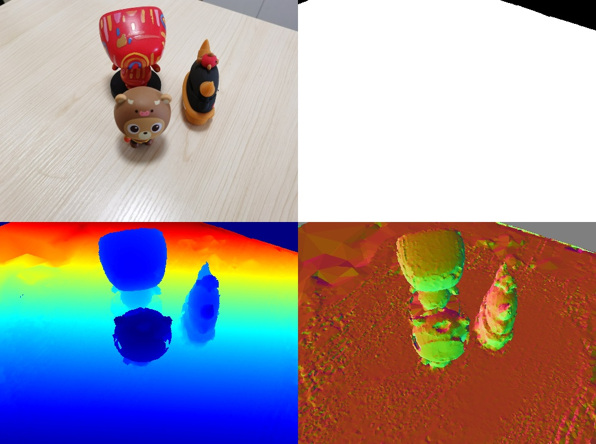
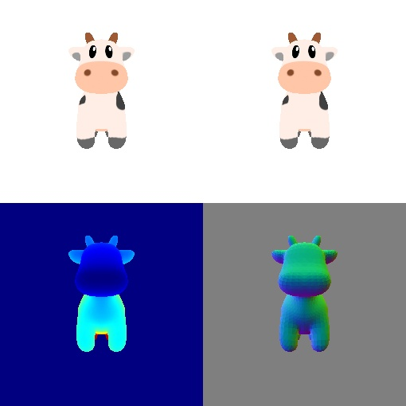

# Render COLMAP reconstructed Model with Pytorch3D


## Dependencies
- PyTorch
- PyTorch3D
- opencv-python
- pillow
- IPython

## Data
### Real Data
```
data_colmap/
├── images/
    └── *.jpg
├── meshed-delaunay.obj
└── sparse
    ├── cameras.bin
    ├── images.bin
    └── points3D.bin

The `sparse/` and `images/` are from the dense reconstruction stage of colmap.

```

https://github.com/guanyingc/pytorch3d_render_colmap/assets/8651158/c66fa0c9-820e-4973-8de0-fa30b3cad540


<p>
     
</p>

### Synthetic Data
The synthetic cow model used in the pytorch3d document.

<p align="center">
     
</p>

## Get Started
```
# Render depth and normal map of a reconstructed mesh using a colmap camera
python render_colmap_mesh.py
```

```
# Render a simple cow mesh
python render_colmap_mesh.py --debug
```

Can also see the [知乎文章：PyTorch3D渲染COLMAP重建的物体](https://zhuanlan.zhihu.com/p/651937759) and [Jupyter Notebook](./render_colmap_mesh.ipynb).

